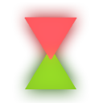

 

  

  
🔺 Triangles 🔻

  

    <a href="https://github.com/davidarutiunian/gamedev/releases">Download</a>
    ·
    <a href="https://github.com/DavidArutiunian/GameDev/issues">Report Bug</a>
    ·
    <a href="https://davidarutiunian.github.io/GameDev" target="_blank">Documentation</a>
  

 

🖌️ Resources & Inspiration 🎨

-   [Main Color Palette](https://coolors.co/ff595e-ffca3a-8ac926-1982c4-6a4c93) 🎨

-   [LGBT Color Palette](https://www.schemecolor.com/lgbt-flag-colors.php) 🏳️‍🌈

-   [UI Assets](https://assetstore.unity.com/packages/2d/gui/icons/simple-button-set-01-153979) 📦
